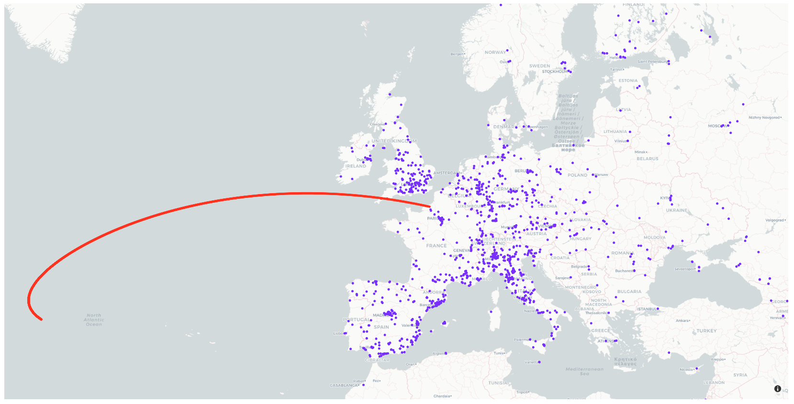

# groundtrack



([2023 CX1](https://en.wikipedia.org/wiki/2023_CX1) impact groundtrack)

Generates images and interactive maps for (impacting) asteroid groundtracks, also plots all observatories with an MPC code.

## Installation

Install or compile the `fo` command line program:

https://www.projectpluto.com/find_sou.htm

More info:

https://www.projectpluto.com/fo_usage.htm

https://www.projectpluto.com/find_orb.htm

Then:

```
git clone https://github.com/void4/groundtrack.git
cd groundtrack
pip install -r requirements.txt
```

You can download the latest MPC observatory data here: https://www.projectpluto.com/mpc_stat.txt

## Usage

For the example above: `python main.py --interactive`

```
$ python main.py --help
usage: groundtrack.py [-h] [--objname OBJNAME] [--obscode OBSCODE]
                      [--latlon LATLON] [--lat LAT] [--lon LON]
                      [--imgpath IMGPATH] [--hide-mpc] [--no-html]
                      [--htmlpath HTMLPATH] [--interactive]
                      [--ephem-start EPHEM_START] [--ephem-size EPHEM_SIZE]
                      [--ephem-steps EPHEM_STEPS]

Plots lon,lat,alt groundtracks of (impacting) asteroids and all observatories
with an MPC code

options:
  -h, --help            show this help message and exit
  --objname OBJNAME     Name of the asteroid groundtrack to plot. Default is
                        2023 CX1
  --obscode OBSCODE     MPC code of the observatory from which to calculate
                        altitude and azimuth angles toward the asteroid.
                        Default is Greenwich (000). You can search for them
                        here: https://www.projectpluto.com/mpc_stat.htm or use
                        the map generated with this tool.
  --latlon LATLON       Observatory latitude and longitude from which to
                        calculate altitude and azimuth angles toward the
                        asteroid. Default is Greenwich.
  --lat LAT             Observatory latitude from which to calculate altitude
                        and azimuth angles toward the asteroid. Default is
                        Greenwich.
  --lon LON             Observatory longitude from which to calculate altitude
                        and azimuth angles toward the asteroid. Default is
                        Greenwich.
  --imgpath IMGPATH     Path to save plot to
  --hide-mpc            Do not plot MPC observatory locations
  --no-html             Do not output html file
  --htmlpath HTMLPATH   Path to store html map to
  --interactive         Open interactive map in browser
  --ephem-start EPHEM_START
                        Datetime of start of ephemeris calculation. Default:
                        "2023 Feb 13 02:00"
  --ephem-size EPHEM_SIZE
                        Size of ephemeris step. Default: "1s"
  --ephem-steps EPHEM_STEPS
                        Number of ephemeris calculation steps to make.
                        Default: 3600
```
